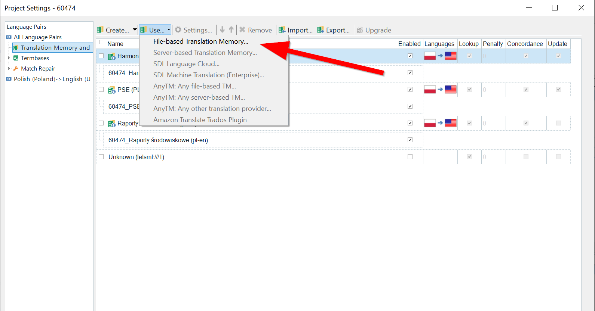
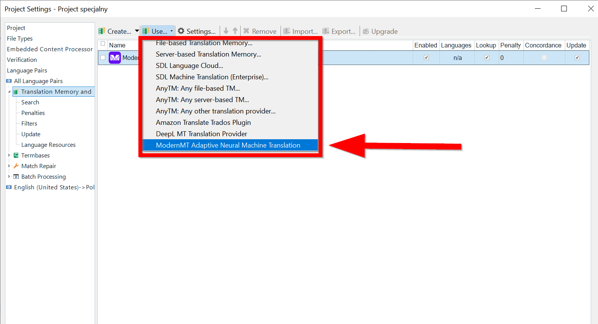
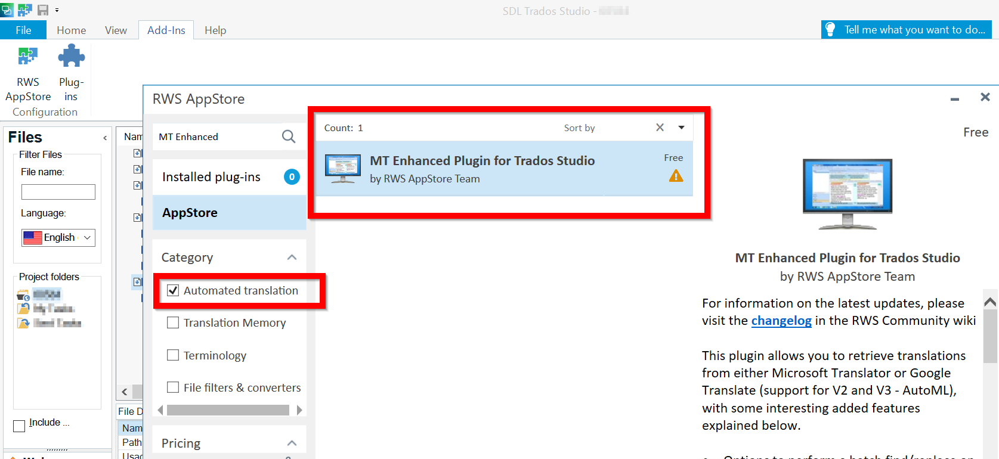
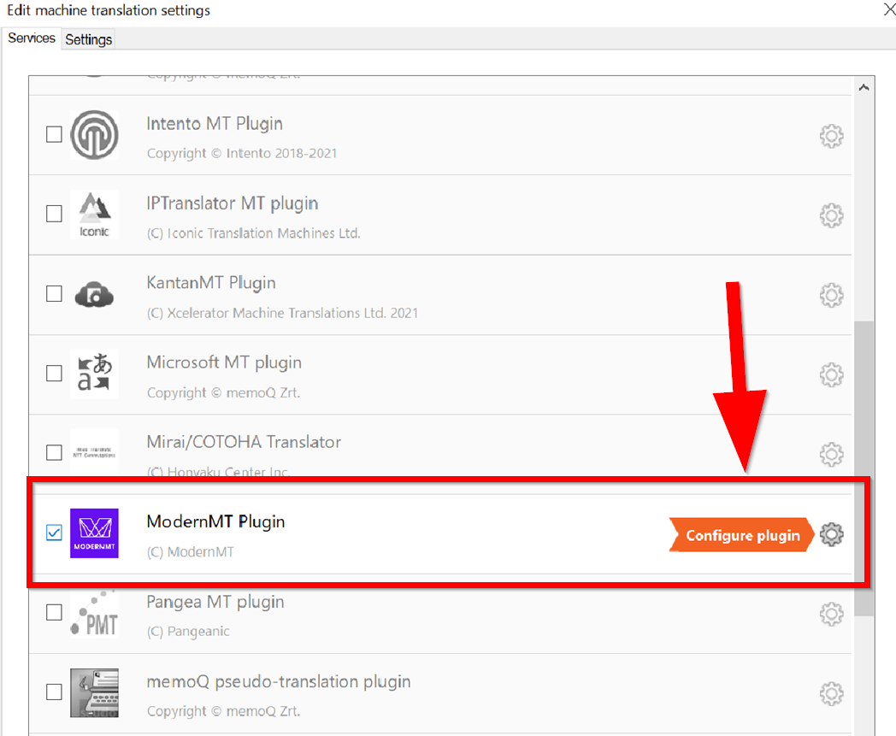
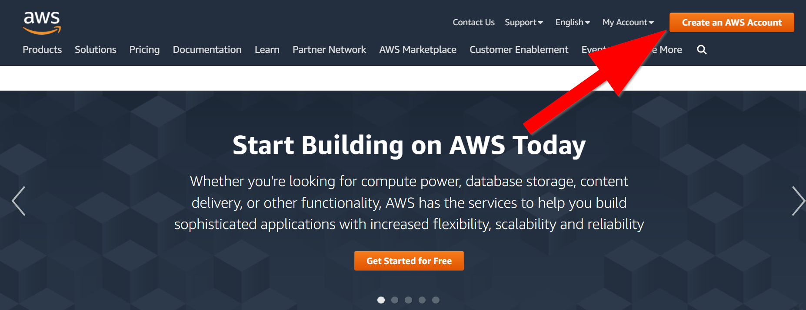
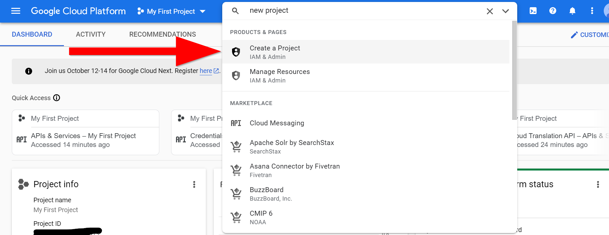
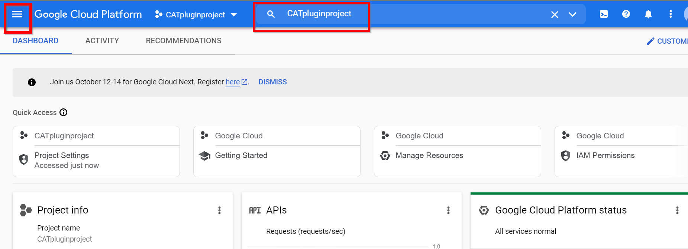
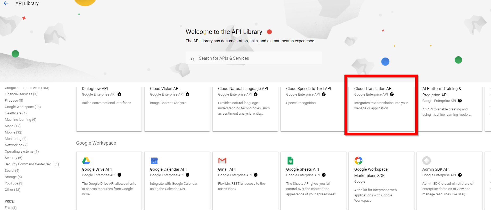
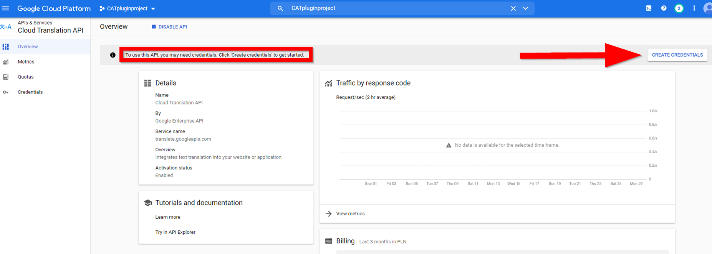

# __HOW TO CONNECT FOUR POPULAR MTs TO TRADOS STUDIO 2021™ AND MEMOQ TRANSLATOR PRO 9.8™__

> ___The biggest challenge is to combine technology and the human side without losing the latter___ — Gordana Antonijević, Head of Translation Unit, Veris

[1. INTRODUCTION](#1-introduction)

* [1.1 MT vendors described](#11-mt-vendors-described)

* [1.2 Privacy](#12-privacy)

[2. How to obtain API keys from MT providers - Trados Studio 2021™](#2-how-to-obtain-api-keys-from-mt-providers-trados-studio-2021)

* [2.1 Amazon Translate (AWS)](#21-amazon-translate-aws)

  -  [2.1.1 How to obtain an API key](#211-how-to-obtain-an-api-key)

   - [2.1.2 How to set up the Trados Studio 2021™ plugin for Amazon Translate (AWS)](#212-how-to-set-up-the-trados-studio-2021-plugin-for-amazon-translate-aws)
   
* [2.2 DeepL](#22-deepl)

  - [2.2.1 How to obtain an API key](#221-how-to-obtain-an-api-key)
  - [2.2.2 How to set up the Trados Studio 2021™ plugin for DeepL](#222-how-to-set-up-the-trados-studio-2021-plugin-for-deepl)

* [2.3 ModernMT](#23-modernmt)

  - [2.3.1 How to obtain an API key](#231-how-to-obtain-an-api-key)

  - [2.3.2 How to set up the Trados Studio 2021™ plugin for ModernMT](#232-how-to-set-up-the-trados-studio-2021-plugin-for-modernmt)

* [2.4 Google Cloud Translation Basic (or Google Translate API v2)](#24-google-cloud-translation-basic-or-google-translate-api-v2)

  - [2.4.1 How to obtain an API key](#241-how-to-obtain-an-api-key)

  - [2.4.2 How to set up the Trados Studio 2021™ plugin for Google Cloud Translation Basic (or Google Translate API v2)](#242-how-to-set-up-the-trados-studio-2021-plugin-for-google-cloud-translation-basic-or-google-translate-api-v2)

  - [2.4.3 How to set up the Google API Validator plugin for Trados Studio 2021™ (optional)](#243-how-to-set-up-the-google-api-validator-plugin-for-trados-studio-2021-optional)

[3. How to obtain API keys from MT providers - Memoq Translator Pro 9.8™](#3-How-to-obtain-API-keys-from-MT-providers-Memoq-Translator-Pro-98)

* [3.1 Amazon Translate (AWS)](#31-amazon-translate-aws)

  -  [3.1.1 How to obtain an API key](#311-how-to-obtain-an-api-key)

  - [3.1.2 How to set up the Memoq Translator Pro 9.8™ plugin for Amazon Translate (AWS) (for a local profile)](#312-how-to-set-up-the-memoq-translator-pro-98-plugin-for-amazon-translate-aws-for-a-local-profile)

* [3.2 DeepL](#32-deepl)

   - [3.2.1 How to obtain an API key](#321-how-to-obtain-an-api-key)

  - [3.2.2 How to set up the Memoq Translator Pro 9.8™ plugin for DeepL](#322-how-to-set-up-the-memoq-translator-pro-98-plugin-for-deepl)

* [3.3 ModernMT](#33-modernmt)

  - [3.3.1 How to obtain an API key](#331-how-to-obtain-an-api-key)

  - [3.3.2 How to set up the Memoq Translator Pro 9.8™ plugin for ModernMT](#332-how-to-set-up-the-memoq-translator-pro-98-plugin-for-modernmt)

* [3.4 Google Cloud Translation Basic (or Google Translate API v2)](#34-google-cloud-translation-basic-or-google-translate-api-v2)

  - [3.4.1 How to obtain an API key](#341-how-to-obtain-an-api-key)

  - [3.4.2 How to set up the Memoq Translator Pro 9.8™ plugin for Google Cloud Translation Basic (or Google Translate API v2)](#342-how-to-set-up-the-memoq-translator-pro-98-plugin-for-google-cloud-translation-basic-or-google-translate-api-v2)

[4. How to obtain API keys from MT providers - Trados Studio 2021™](#4-How-to-obtain-API-keys-from-MT-providers-Trados-Studio-2021™)

* [4.1 Amazon Translate (AWS) API Key](#41-amazon-translate-aws-api-key)

  - [4.1.1 How to obtain an API key](#411-how-to-obtain-an-api-key)

    - [4.1.1.2 Create an AWS account.](#4112-create-an-aws-account)

* [4.2 DeepL](#42-deepl)

  -  [4.2.1 How to obtain an API key](#421-how-to-obtain-an-api-key)

     - [4.2.1.1 Create a DeepL account here](#4211-create-a-deepl-account-here)

* [4.3 ModernMT](#43-modernmt)

   - [4.3.1 How to obtain an API key](#431-how-to-obtain-an-api-key)

     - [4.3.1.1 ModernMT account](#4311-modernmt-account)

* [4.4 Google Cloud Translation Basic (or Google Translate API v2)](#44-google-cloud-translation-basic-or-google-translate-api-v2)

  - [4.4.1 How to obtain an API key](#441-how-to-obtain-an-api-key)

[5. References](#5-references)
## 1. INTRODUCTION
Machine Translation (MT) technology allows you to automatically translate your text from one language to another. Both Trados Studio 2021™ and memoQ translator pro 9.8™ use plugins to connect to machine translation engine vendors. This manual provides information as to how to obtain API keys from MT vendors and enter them into the plugins. 
*Disclaimer*
Information contained herein is valid as of October 1st, 2021. Due to frequent changes in user interfaces utilised by MT vendors this information may become obsolete after that date without advance notice. Revision 1.0.
### 1.1 MT vendors described
This manual shows how to obtain APIs to the following MTs:

| MT name | Advantages | Disadvantages | Cost |
| ----------- | ----------- | ----------- | ----------- |
| Google Cloud Translation Basic (or Google Translate API v2)  | best known vendor, numerous language pairs available  | quality differs per language pair, very complicated set-up  | paid service with free quota |
| DeepL  |  very high quality, easy set-up  | limited number of language pairs  | paid service with free trial |
| Amazon Translate (AWS)   |  numerous language pairs available | quality differs per language pair, complicated set-up  | paid service with free quota |
| Modern MT   |  high quality vendor, easy set-up | limited number of language pairs  | paid service with adaptive functions in basic plan |

### 1.2 Privacy
More information about the way in which your data is processed by the MT vendors listed in point 1.1 of this manual is available from:

 - for DeepL:
 [https://www.deepl.com/pro-data-security/](https://www.deepl.com/pro-data-security/)
 - for Google Cloud Translation Basic (or Google Translate API v2):
 [https://cloud.google.com/translate/data-usage](https://cloud.google.com/translate/data-usage)
 - Amazon Translate (AWS):
 [https://docs.aws.amazon.com/translate/latest/dg/data-protection.html](https://docs.aws.amazon.com/translate/latest/dg/data-protection.html)
 - Modern MT:
 [https://www.modernmt.com/privacy/](https://www.modernmt.com/privacy/)

## 2. How to obtain API keys from MT providers - Trados Studio 2021™
### 2.1 Amazon Translate (AWS)
#### 2.1.1 How to obtain an API key
Refer to Point 4.1 for details.

#### 2.1.2 How to set up the Trados Studio 2021™ plugin for Amazon Translate (AWS)
 - Open your desktop version of Trados Studio 2021™.
 
 - Go to **Add-ins > RWS AppStore**. Search for **Amazon Translate MT Provider** and download it. Restart Trados Studio 2021™.
 
 - Go to **Project Settings**. In the **Translation Memory and Automated Translation** settings window select the provider by clicking **Use...** > **Amazon Translate Trados Plugin**.

<!--  -->

<!--  -->

- Enter necessary credentials in the **Authentication** window.

    - Select **Access key  / Secret access key** in the **Choose AWS auth type** drop down menu.
		
    - Enter the **AWS region name**, **Access key** and **Secret access key** credentials in the appropriate fields. Check the **Save access keys for future sessions** option.
    
     - Confirm by clicking **OK**.

The **Amazon Translate Trados Plugin** plugin is now visible in the **Translation Memory and Automated Translation** settings window. You may start using this service now.

### 2.2 DeepL
#### 2.2.1 How to obtain an API key
Refer to Point 4.2 for details.

#### 2.2.2 How to set up the Trados Studio 2021™ plugin for DeepL

- Open your desktop version of Trados Studio 2021™.

- Go to **Add-ins > RWS AppStore**. Search for **DeepL Translation Provider** and download it. Restart Trados Studio 2021™.

- Go to **Project Settings**. In the **Translation Memory and Automated Translation** settings window select the provider by clicking **Use...** > **DeepL MT Translation Provider**.

 - Enter the API key. Click **OK**.
 
 - Add the following domains to your firewall/antivirus exceptions: www2.deepl.com and api.deepl.com.
 
 - Please check if the API key is added correctly. Read this article for more information: [https://gateway.sdl.com/apex/communityknowledge?articleName=000013232](https://gateway.sdl.com/apex/communityknowledge?articleName=000013232)

The **DeepL MT Translation Provider** plugin is now visible in the **Translation Memory and Automated Translation** settings window. You may start using this service now.

### 2.3 ModernMT
#### 2.3.1 How to obtain an API key
Refer to Point 4.3 for details.

#### 2.3.2 How to set up the Trados Studio 2021™ plugin for ModernMT
- Open your desktop version of Trados Studio 2021™.

- Go to **Add-ins > RWS AppStore**. Search for **ModernMT** and download it. Restart Trados Studio 2021™.

- Go to **Project Settings**. In the **Translation Memory and Automated Translation** settings window select the provider by clicking **Use...** > **Modern MT Adaptive Neural Machine Translation**.

 - Enter the API key. Click **OK**.
 
 - You may select the translation memories to use with your project. Click **OK**.

The **Modern MT Adaptive Neural Machine Translation** plugin is now visible in the **Translation Memory and Automated Translation** settings window. You may start using this service now.
### 2.4 Google Cloud Translation Basic (or Google Translate API v2)
#### 2.4.1 How to obtain an API key
Refer to Point 4.4 for details.

#### 2.4.2 How to set up the Trados Studio 2021™ plugin for Google Cloud Translation Basic (or Google Translate API v2)

- Open your desktop version of Trados Studio 2021™.

- Go to **Add-ins > RWS AppStore**. Search for **MT Enhanced Plugin for Trados Studio** and download it.

- Restart Trados Studio 2021™.

- Go to **Project Settings**. In the **Translation Memory and Automated Translation** settings window select the provider by clicking **Use...** > **MT Enhanced Trados Plugin**.

- Open the uppermost drop-down menu to choose which MT provider you want to use. Select **Google Translator**.

- Below the uppermost drop-down menu there is another one in which you can select which version of the Google Translate API you wish to use. Open it and select **V2-Basic Translation**.

 - Enter the API key in the field below. Check the **Save Google key**.
 
 - Click **OK**.

The **MT Enhanced Plugin for Trados Studio** plugin is now visible in the **Translation Memory and Automated Translation** settings window. It is displayed as **MT Enhanced using Google Translate Basics** in the opened window. You may start using this service now.

#### 2.4.3 How to set up the Google API Validator plugin for Trados Studio 2021™ (optional)

This plugin is not required for the **Google Cloud Translation Basic (or Google Translate API v2)** service to work with Trados Studio 2021™, but it enhances the usability of this MT. The plugin has been developed to provide a simple and fast way to validate the credentials being used to access the Google Translate API.

 - Open your desktop version of Trados Studio 2021™.
 - Go to **Add-ins > RWS AppStore**. Search for **Google API Validator** and download it. By default, it is saved in the following destination: C:\Users\User1\AppData\Roaming\SDL Community\AppStore Integration\Downloads\GoogleApiValidator.Setup.zip.
 
In your system the \Users\User1 part of the path shown here will most likely be different. The path has been included here as an example, not a precise indication of the .zip file location.

 - Install the file by clicking it and follow the on-screen commands.
 
 - After the plugin is installed, restart Trados Studio 2021™. The plugin is now ready for use.
 
 More information on this plugin is available **[here](https://community.sdl.com/product-groups/translationproductivity/w/customer-experience/5493/google-api-validator).**

## 3. How to obtain API keys from MT providers - Memoq Translator Pro 9.8™
### 3.1 Amazon Translate (AWS)
#### 3.1.1 How to obtain an API key
Refer to Point 4.1 for details.

#### 3.1.2 How to set up the Memoq Translator Pro 9.8™ plugin for Amazon Translate (AWS) (for a local profile)

 - Click **memoQ** tab in the upper, left corner of the dashboard.
 

 - Click **Options**. A new pane appears. Click **Options** in the **memoQ options** menu. Wait for the **Default resources** pane to open.
 

 -  At the top of the pane there is a row of icons. Click the **MT Settings** icon, which is the first icon from the right.
 
 - If you have already set up an MT profile or profiles, select one of them from the list and click **OK** to confirm that you read the message > **Edit**.
	

  - If you have not set up an MT profile yet, open the **Language** drop-down menu, and select a language. In the **Name/description** field enter a name. Click **Create new** at the bottom of the pane. In the **Create new MT settings** window enter the name and description.
	Click **OK**. Check the new profile visible in the list. Click **OK** to confirm that you read the message > **Edit**.
	

 - In the **Edit machine translation settings** windows go to the **Services** tab and check the **AWS Amazon Translate** plugin. Click **OK** to confirm that you read the message. To prevent this message from displaying again, check **Do not show this warning** option. Click the cogwheel icon or double click the name of the plugin.

 
 - In the **Amazon Translate plugin settings** enter your Access key and Secret access key in the two text fields. Select your region from the Region drop-down menu. It must be the same region as the one specified in your Amazon credentials. More information about other options available in this window are available **[here](https://docs.memoq.com/current/en/Places/amazon-mt-plugin-settings.html)**.  Click **OK**, then click **OK** again.
 

You may start using this service now.

### 3.2 DeepL
#### 3.2.1 How to obtain an API key
Refer to Point 4.2 for details.

#### 3.2.2 How to set up the Memoq Translator Pro 9.8™ plugin for DeepL
- Click **memoQ** tab in the upper, left corner of the dashboard.

- Click **Options**. A new pane appears. Click **Options** in the **memoQ options** menu. Wait for the **Default resources** pane to open.

 
- At the top of the pane there is a row of icons. Click the **MT Settings** icon, which is the first icon from the right.

- If you have already set up an MT profile or profiles, select one of them from the list and click **OK** to confirm that you read the message > **Edit**.

 
- If you have not set up an MT profile yet, open the **Language** drop-down menu, and select a language. In the **Name/description** field enter a name. Click **Create new** at the bottom of the pane. In the **Create new MT settings** window enter the name and description. Click **OK**. Check the new profile visible in the list. Click **OK** to confirm that you read the message > **Edit**.
	

 
 - In the **Edit machine translation settings** windows go to the **Services** tab and check the **DeepL MT Plugin**. Click **OK** to confirm that you read the message. To prevent this message from displaying again, check **Do not show this warning** option. Click the cogwheel icon or double click the name of the plugin.

 - In the **DeepL MT plugin settings** enter your DeepL API key in the **Auth key** field.  Click  **OK**.  Check the  **Enable plugin**  check box in the list of machine translation plugins. Click  **OK**  again to close the  **Options**  dialog.

 

You may start using this service now.

### 3.3 ModernMT
#### 3.3.1 How to obtain an API key
Refer to Point 4.3 for details.

#### 3.3.2 How to set up the Memoq Translator Pro 9.8™ plugin for ModernMT
- Click **memoQ** tab in the upper, left corner of the dashboard.

- Click **Options**. A new pane appears. Click **Options** in the **memoQ options** menu. Wait for the **Default resources** pane to open.

 - At the top of the pane there is a row of icons. Click the **MT Settings** icon, which is the first icon from the right. 
 
 - If you have already set up an MT profile or profiles, select one of them from the list and click **OK** to confirm that you read the message > **Edit**.

 - If you have not set up an MT profile yet, open the **Language** drop-down menu, and select a language. In the **Name/description** field enter a name. Click **Create new** at the bottom of the pane. In the **Create new MT settings** window enter the name and description. Click **OK**. Check the new profile visible in the list. Click **OK** to confirm that you read the message > **Edit**.
	

 - In the **Edit machine translation settings** windows go to the **Services** tab and check the **Modern MT Plugin**. Click **OK** to confirm that you read the message. To prevent this message from displaying again, check **Do not show this warning** option. Click the cogwheel icon or double click the name of the plugin.

 
 
 - In the **Modern MT settings** enter your Modern MT API key in the field. Click  **Login**.  Select one of the translation memories or create a new one. Click  **OK**  again to close the  **Options**  dialog.
 
 
 
You may start using this service now.

### 3.4 Google Cloud Translation Basic (or Google Translate API v2)
#### 3.4.1 How to obtain an API key
Refer to Point 4.4 for details.

#### 3.4.2 How to set up the Memoq Translator Pro 9.8™ plugin for Google Cloud Translation Basic (or Google Translate API v2)

- Click **memoQ** tab in the upper, left corner of the dashboard.

- Click **Options**. A new pane appears. Click **Options** in the **memoQ options** menu. Wait for the **Default resources** pane to open.
 

 
  - At the top of the pane there is a row of icons. Click the **MT Settings** icon, which is the first icon from the right.
 
  - If you have already set up an MT profile or profiles, select one of them from the list and click **OK** to confirm that you read the message > **Edit**.
  

  - If you have not set up an MT profile yet, open the **Language** drop-down menu, and select a language. In the **Name/description** field enter a name. Click **Create new** at the bottom of the pane. In the **Create new MT settings** window enter the name and description. Click **OK**. Check the new profile visible in the list. Click **OK** to confirm that you read the message > **Edit**.

  - In the **Edit machine translation settings** windows go to the **Services** tab and check the **Google Cloud Translation Basic plugin**. Click **OK** to confirm that you read the message. To prevent this message from displaying again, check **Do not show this warning** option. Click the cogwheel icon or double click the name of the plugin.
 

 
 - In the **Google MT Plugin settings** enter your Google API key in the **Key for API v2.0** field. Do not change the text in the **Referer**  box . Click  **OK**.  Check the  **Enable plugin**  check box in the list of machine translation plugins. Click  **OK**  again to close the  **Options**  dialog.
 

 
You may start using this service now.

## 4. How to obtain API keys from MT providers - Trados Studio 2021™
### 4.1 Amazon Translate (AWS) API Key
#### 4.1.1 How to obtain an API key
##### 4.1.1.2 Create an **[AWS account](https://aws.amazon.com/)**

 -  You need your debit/credit card to accomplish this step. One USD/EUR is then temporarily charged to your bank account. Provide your personal details. In the next step select the payment plan:

  

 - Next configure your account locally. Download and install the **[AWS CLI](https://aws.amazon.com/cli/)** (Command Line Interface). Additional information on how to accomplish this task may be found in the **[AWS Documentation](https://docs.aws.amazon.com/cli/latest/userguide/awscli-install-windows.html)**.

 - Look for necessary credentials in your **AWS Management Console**.
 
 - Click the name of your account in the upper, right corner of the page.
 
 - Select **My Security Credentials**.
 
 - Click **Access keys (access key ID and secret access key)**.
 
 - Generate the key. Download the key file. Remember to store it in a safe place.
 
 -  Run AWS CL by **[opening a windows command prompt](https://www.lifewire.com/how-to-open-command-prompt-2618089).** Type in `aws configure`.
 
 - When prompted enter the required data. Confirm by pressing Enter after each line. When prompted for the **Default region name** enter `us-west-2` or follow the instructions given here: [https://docs.aws.amazon.com/general/latest/gr/rande.html](https://docs.aws.amazon.com/general/latest/gr/rande.html).

  - Type in `aws configure` again. This is an example of what you should see then:

You have successfully set up your AWS credentials, incl. your API key.

### 4.2 DeepL
#### 4.2.1 How to obtain an API key
##### 4.2.1.1 Create a DeepL account [here](https://www.deepl.com/pro.html)

 -  Select DeepL Pro payment plan. You need your debit/credit card to register your account. Provide your personal details. Confirm each step.
 
 - Press **Retrieve your Authentication Key** in the last screen. 
 
 - Go to **Account**. Your API key is at the bottom of the screen under ** Authentication Key for DeepL API**. Copy it and store it in a safe location.

### 4.3 ModernMT
#### 4.3.1 How to obtain an API key
##### 4.3.1.1 ModernMT account

Create a ModernMT account [here](https://www.modernmt.com/pricing/).

- Click **Plugins for translators** > **Get a license**.

- You need your debit/credit card to register your account. Provide your personal details.

- Click **Start your plan**.

- Copy your activation key from the **Here’s your activation key** field. Store it in a safe location.

### 4.4 Google Cloud Translation Basic (or Google Translate API v2)
#### 4.4.1 How to obtain an API key
##### 4.4.1.1 Google Account

To use this MT vendor you need to have your regular Google Account. Set it up and log in to it. Then log in [here](https://console.developers.google.com/cloud-resource-manager).

 - Go to **Billing** > **Add a billing account**. Accomplish all the required steps of the procedure.
 

 - You should find yourself in the **Dashboard** view. As there are frequent changes to the **Google Cloud Platform** the page you find yourself may be different.
 

 - Type in `new project` in the search window. Click **Create a Project IAM & Admin**.
 

 - Assign a name to your project in the **Project name** field (for example **CATpluginproject**). Write it down for future use. Click **Create**.

 - Type in your project name in the search window and press **Enter**. Click the project name in the results window.
 
 - In the upper, left corner of the page the drop-down menu has changed its name to the name of your project. Open the menu, and click the name of this project (for example **CATpluginproject**).
 

 - The name of your project is now visible in the **Search** window in the middle of the upper part of the page. Click **Menu** (three horizontal lines one under another in the left corner) > **APIs & services**.
 

 - Click **ENABLE APIS AND SERVICES**.
 

 - In the left margin click **Machine Learning**.
 

 - Click **Cloud Translation API** > **Enable**.
 

 - To use this API, you need credentials. Click **Create credentials** to get started.
 

 - From the **Select and API** drop-down menu select **Cloud Translation API**.
 

 - Click **Cancel**.
 

 - In the upper part of the dashboard click **CREATE CREDENTIALS** > **API key**.
 

 - Wait fo the API key to be created. Remember to copy it and store in a safe location. Clik **RESTRICT KEY** to prevent unauthorized use in production.
 

 - Allow the **Restrict key** option. In the drop-down menu select **Cloud Translation API**. Click **Save**.
  

You now have your API key set up.

## 5. References
- [https://docs.memoq.com/current/en/Places/modernmt-settings.html](https://docs.memoq.com/current/en/Places/modernmt-settings.html), accessed on 29/09/2021
- [https://helpcenter.memoq.com/hc/en-us/articles/360019498179-How-to-set-up-the-DeepL-MT-plugin](https://helpcenter.memoq.com/hc/en-us/articles/360019498179-How-to-set-up-the-DeepL-MT-plugin), accessed on 27/09/2021
- [https://blog.api.rakuten.net/api-tutorial-google-translate-api/](https://blog.api.rakuten.net/api-tutorial-google-translate-api/), accessed on 28/09/2021
- [https://community.sdl.com/product-groups/translationproductivity/f/openexchange_applications/27164/deepl-plugin-not-working](https://community.sdl.com/product-groups/translationproductivity/f/openexchange_applications/27164/deepl-plugin-not-working), accessed on 25/09/2021
- [https://helpcenter.memoq.com/hc/en-us/articles/360010267380-Installing-Google-Translate-API-plugin-in-memoQ](https://helpcenter.memoq.com/hc/en-us/articles/360010267380-Installing-Google-Translate-API-plugin-in-memoQ), accessed on 29/09/2021
- [https://community.sdl.com/product-groups/translationproductivity/f/trados-live/30935/google-translate-api---how-to-activate-in-sdl-trados-live](https://community.sdl.com/product-groups/translationproductivity/f/trados-live/30935/google-translate-api---how-to-activate-in-sdl-trados-live), accessed on 29/09/2021
- [https://docs.aws.amazon.com/translate/latest/dg/API_Reference.html](https://docs.aws.amazon.com/translate/latest/dg/API_Reference.html), accessed on 28/09/2021
- [https://docs.aws.amazon.com/translate/latest/dg/translate-dg.pdf](https://docs.aws.amazon.com/translate/latest/dg/translate-dg.pdf), accessed on 27/09/2021
- [https://docs.weblate.org/en/latest/admin/machine.html#aws](https://docs.weblate.org/en/latest/admin/machine.html#aws), accessed on 30/09/2021
- [https://community.sdl.com/product-groups/translationproductivity/w/customer-experience/3315/amazon-translate-mt-provider](https://community.sdl.com/product-groups/translationproductivity/w/customer-experience/3315/amazon-translate-mt-provider), accessed on 28/09/2021
- [https://docs.aws.amazon.com/general/latest/gr/rande.html](https://docs.aws.amazon.com/general/latest/gr/rande.html), accessed on 30/09/2021
- [https://docs.aws.amazon.com/cli/latest/userguide/cli-configure-files.html](https://docs.aws.amazon.com/cli/latest/userguide/cli-configure-files.html), accessed on 30/09/2021
- [https://docs.aws.amazon.com/cli/latest/userguide/cli-configure-quickstart.html](https://docs.aws.amazon.com/cli/latest/userguide/cli-configure-quickstart.html), accessed on 29/09/2021
- [https://www.deepl.com/pl/pro/change-plan#team](https://www.deepl.com/pl/pro/change-plan#team), accessed on 30/09/2021
- [https://translatepress.com/docs/automatic-translation/generate-google-api-key/](https://translatepress.com/docs/automatic-translation/generate-google-api-key/), accessed on 28/09/2021
- [https://community.sdl.com/product-groups/translationproductivity/f/openexchange_applications/30609/google-translate-api-not-available-in-sdl-trados-2021?ReplySortBy=CreatedDate&ReplySortOrder=Ascending](https://community.sdl.com/product-groups/translationproductivity/f/openexchange_applications/30609/google-translate-api-not-available-in-sdl-trados-2021?ReplySortBy=CreatedDate&ReplySortOrder=Ascending), accessed on 26/09/2021
- [https://gateway.sdl.com/apex/communityknowledge?articleName=000005906](https://gateway.sdl.com/apex/communityknowledge?articleName=000005906), accessed on 25/09/2021
- [https://cloud.google.com/docs/authentication/api-keys#creating_an_api_key](https://cloud.google.com/docs/authentication/api-keys#creating_an_api_key), accessed on 29/09/2021
- [https://www.modernmt.com/api/#introduction](https://www.modernmt.com/api/#introduction), accessed on 27/09/2021
- [https://www.youtube.com/watch?v=-KHq094SeWU](https://www.youtube.com/watch?v=-KHq094SeWU), accessed on 26/09/2021
- [https://www.deepl.com/pl/pro-tool_integration.html](https://www.deepl.com/pl/pro-tool_integration.html), accessed on 27/09/2021
- [https://developers.google.com/tech-writing/one/short-sentences](https://developers.google.com/tech-writing/one/short-sentences), accessed on 26/09/2021

- [https://modernmt-website.s3.amazonaws.com/downloads/ModernMT+Plugin+Guide+for+SDL+Trados+Studio.pdf](https://modernmt-website.s3.amazonaws.com/downloads/ModernMT+Plugin+Guide+for+SDL+Trados+Studio.pdf), accessed on 28/09/2021

- [https://docs.memoq.com/ggl-tst/Places/mt-settings.html](https://docs.memoq.com/ggl-tst/Places/mt-settings.html), accessed on 29/09/2021 

